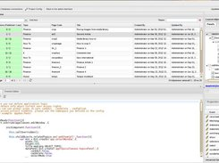
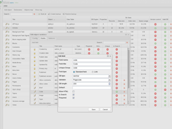
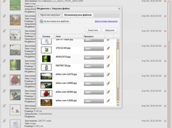
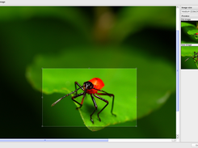
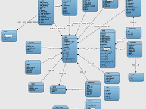

[](https://packagist.org/packages/dvelum/dvelum)
[](https://packagist.org/packages/dvelum/dvelum)


[Внимание, стабильная ветка 2.x](https://github.com/dvelum/dvelum/tree/2.x)
===

DVelum 3.x
======

PHP/ExtJS-based web development platform
------


DVelum is a professional web-development platform based on PHP and ExtJS that aims at automating routine development tasks and facilitates programming by means of a graphical interface.
It offers the highest real-time performance, facilitates and speeds up the development process letting you concentrate on business logic and ignore minor issues.
DVelum is an indispensable toolkit for development of both complex-structured systems (eCommerce, CRM, backoffice etc. ) and simple websites.

GNU General Public License version 3.0

    

Local installation
-----

```
composer create-project dvelum/dvelum
```
Apache VirtualHost configuration example
```
<VirtualHost *:80>
    ServerName dvelum.local
    DocumentRoot /path/to/dvelum/www
    <Directory "/path/to/dvelum/www">
        Require all granted
        AllowOverride All
        Options +ExecCGI -Includes -Indexes
     </Directory>
</VirtualHost>
```
Add local domain to /etc/hosts
```
127.0.0.1 dvelum.local
```

Open Web Browser at http://dvelum.local/install and follow the instructions

Official modules
-----
Official modules can be installed using composer or "External modules" section of admin panel

* [CMS](https://github.com/dvelum/module-cms) - Content Management System
* [FileStorage](https://github.com/dvelum/module-filestorage) - File storage 
---
[Документация](docs/ru/developer/readme.md)

---


Issues https://github.com/dvelum/dvelum/issues

DVelum 2.x Repo https://github.com/dvelum/dvelum/tree/2.x

DVelum 0.x/1.x Repo https://github.com/k-samuel/dvelum

Old Version Downloads https://sourceforge.net/projects/dvelum/files/ and https://code.google.com/p/dvelum/downloads/list?can=1

Official Site (ENG) http://dvelum.net

Official Site (RU)  http://dvelum.ru


