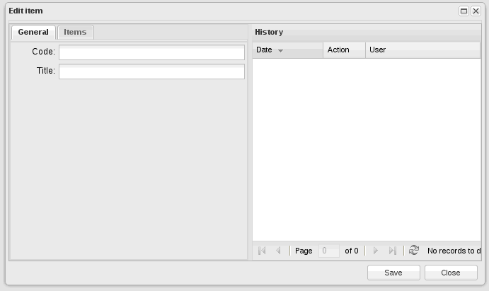

[документация](readme.md)
#Компонент app.editWindow

Компонент представляет собой окно - заготовку для работы с Backend_Controller_Crud, то есть интерфейс редактирования объекта, не находящегося под версионным контролем.

Для работы необходимо указать набор полей для редактирования, обычно это делается при помощи дизайнера интерфейсов, но возможно и вручную, передав в конструктор свойство.
Основные свойства:

* **items** {object} - должно содержать описание полей для редактирования, будет перемещено в  'Ext.tab.Panel' items (панель вкладок, находящуюся внутри окна), эту особенность необходимо учесть (корневые элементы будут рассматриваться как панели вкладок);
* **controllerUrl** {string} -  url-адрес контроллера, обрабатывающего запросы на изменение объекта;
* **objectName** {string} - имя объекта ORM, который редактирует окно;
* **canEdit** {boolean} - права на редактирование;
* **canDelete** {boolean} - права на удаление;
* **canPublish** {boolean} - права на публикацию.
* **useTabs** {boolean} (default true) - использовать Tab  панель для вложенных элементов

Основные методы:   
* **getForm()** -  метод, получить форму (Ext.form.Panel)

Так же окно способно самостоятельно обработать данные  app.relatedGridPanel, если такой компонент передан в свойстве items (используется для редактирования связи один ко многим).

Пример окна с заполненными полями для редактирования:

