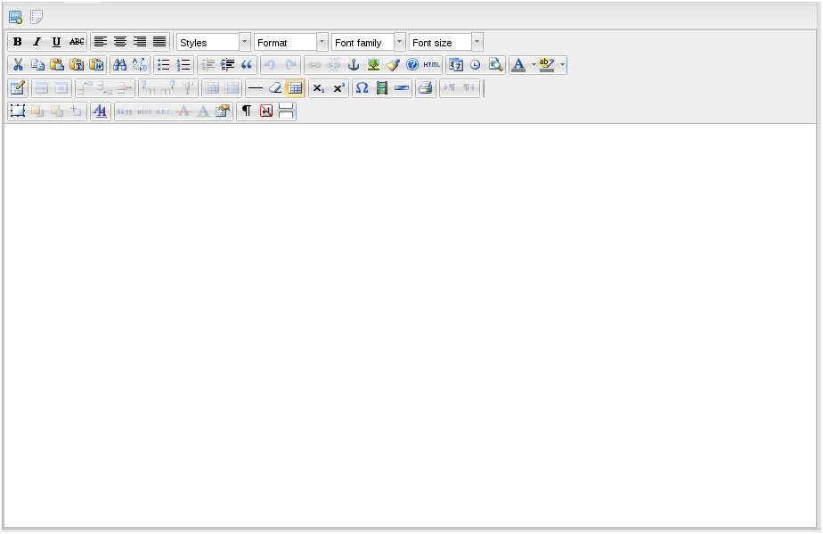

Компонент app.medialib.HtmlPanel
===
[<< документация](readme.md)

Панель с WYSIWYG редактором.

В зависимости от настройки системы может содержать  редактор  TinyMCE или CKEditor, включает дополнительный тулбар с кнопками добавления изображений из медиатеки и ссылок на файлы из медиатеки:

##### Основные свойства:
* **editorName** {string} - имя поля формы, используется при отправке формы.

