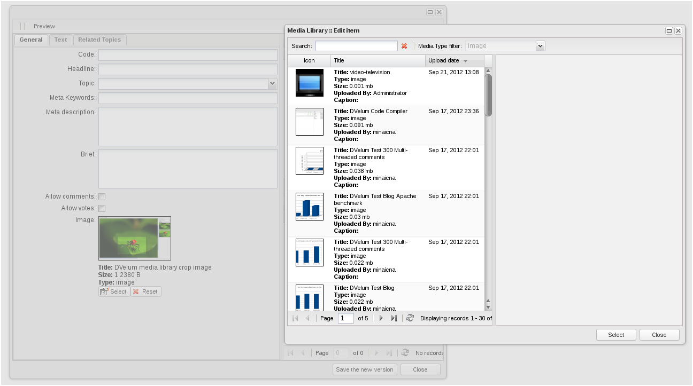

[документация](readme.md)
#Компонент app.medialib.ItemField

Поле формы, осуществляет выбор файла из медиатеки.

При клике на кнопку ‘Select’ открывает окно выбора файла медиатеки.
Кнопка ‘Reset’ отменяет выбор.

Основные свойства:

* **resourceType** {string}  - тип выбираемого ресурса, может быть 'all', ‘image’, ’audio’, ’video’, ’file’;
* **linkName** {string} - имя поля, используется при отправке формы (отправляется идентификатор объекта медиатеки).

