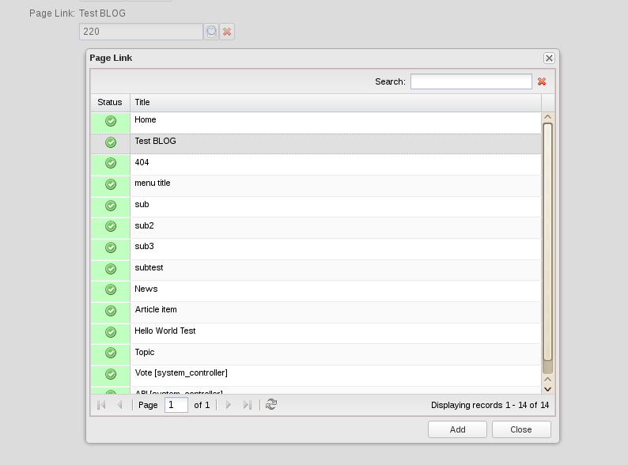

Компонент app.objectLink.Field
===
[<< документация](readme.md)

Компонент поле выбора связанного объекта

##### Основные свойства:

* **controllerUrl** {string} - контроллер отвечающий за предоставление данных о списке доступных объектов для связи, выдающий заголовок для объекта (должен содержать методы linkedlistAction , otitleAction)
* **objectName**  {string} - имя связанного объекта (например News, Page, Articles ...)
* **value** {integer} -  идентификатор связанного объекта name - строка, имя поля формы
* **fieldLabel** {string} - лейбл формы

##### Основные методы:

* **showSelectionWindow()** - отобразить окно выбора связанного объекта
* **getValue()** - получить значение
* **setValue(value)** - установить значение
* **reset()** - сбросить значение

