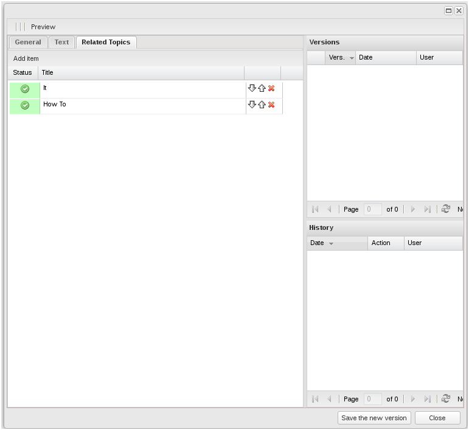
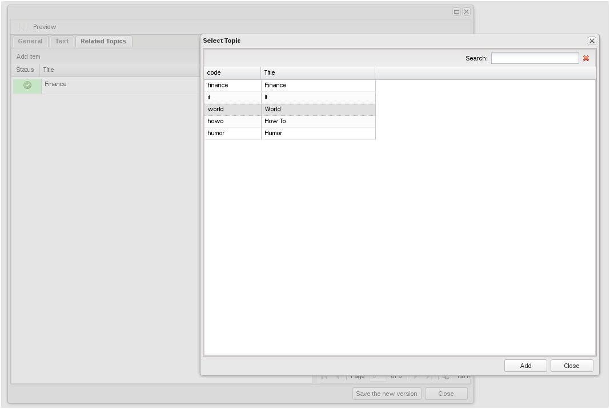

Компонент app.relatedGridPanel
===
[<< документация](readme.md)

Таблица связанных объектов, обычно используется для редактирования полей объектов ORM с типом multylink, позволяет редактировать список ссылок на связанные объекты.



##### Основные свойства:

fieldName string - имя поля (как у любого поля формы), служит для передачи данных при отправке формы.

##### Основные методы:

* **setData(data)** - задать данные таблицы, принимает в качестве параметра массив объектов со структурой:
```javascript
[
    {name:'id' , type:'integer'},
    {name:'published' , type:'boolean'},
    {name:'deleted' , type:'boolean'},
    {name:'title' , type:'string'}
]
```

* **addRecord(record)** - record app.relatedGridModel,  добавить запись в таблицу;
* **collectData()** - получить данные таблицы, возвращает массив идентификаторов строк.

##### В объекте определено событие:

**addItemColl** - отрабатывает при нажатии кнопки 'Add Item', на это событие необходимо навесить слушатель, который займется отработкой.


Пример работы с этим компонентом:
```javascript
this.childObjects.relatedTopics.on('addItemCall',function(){
	var win = Ext.create('app.SelectWindow',{
		width:700,
		height:600,
 		title:appLang.SELECT_TOPIC,
 		dataPanel:Ext.create('appTopicsClasses.topicsPanel',{
			canEdit:false,
			canDelete:false,
			selectMode:true
		}),
		listeners:{
			'itemSelected':{
				fn:function(record){
					this.childObjects.relatedTopics.addRecord(record);
				},
				scope:this
			}

		}
	}).show();   
}, this);
```
В этом коде определяется обработчик события addItemCall  для компонента  relatedTopics, который является объектом типа  app.relatedGridPanel. Этот компонент отвечает за  добавление связанных топиков к статье. По событию создается объект типа  app.SelectWindow, описание которого так же можно найти в разделе документации. Окно содержит панель редактирования топиков (она определена в связанном проекте), которая кроме прочих возможностей реализует возможность выбора топика. Сигнализатором этого действия является событие itemSelected, которое при запуске отдает record выбраной записи. SelectWindow в данном примере является адаптером для app.relatedGridPanel и мостом к панели редактирования топиков.

По клику на addItem в app.relatedGridPanel создается окно, которое содержит редактор статей в режиме «Только чтение». При выборе конкретной записи в панели редактирования топиков, данные об этой записи отправляются в app.relatedGridPanel. Нагляднее на рисунке:



Для редактирования статей в данном примере используется окно типа app.contentWindow, которое самостоятельно без дополнительных настроек определяет наличие вложенного элемента app.relatedGridPanel и при отправке формы самостоятельно собирает из него данные, отправляя их в виде массива. В свою очередь стандартный контроллер Backend_Orm_Controller способен самостоятельно разобрать и сохранить данные для поля myltilink объекта ORM без дополнительных настроек.

Использование этого компонента значительно упрощает работу со списком ссылок на объекты, но требует дополнительного времени на изучение принципа подобной обработки. При понимании механизма создание редактора списка связанных объектов  займет несколько минут.