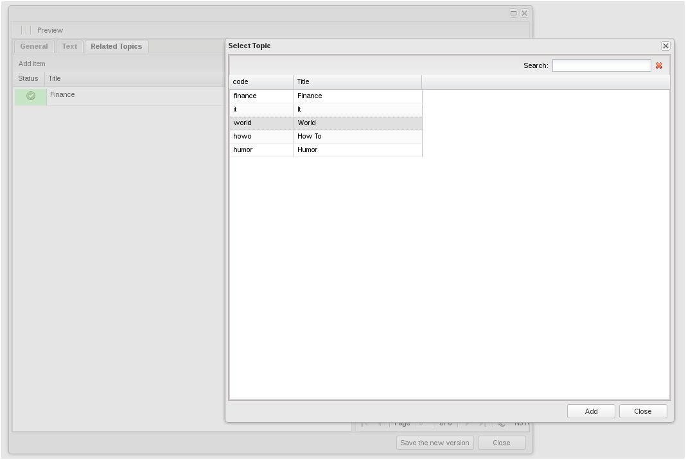

Компонент app.selectWindow
===
[<< документация](readme.md)

Компонент является  мостом  между различными интерфейсными элементами, реализует функционал выбора записи из таблицы. Представляет собой окно с возможностью выбора элемента Grid (Grid передается в виде параметра).

#####Основное свойства:

* **dataPanel**  {object} - Объект, панель вывода списка элементов, которая должна быть отнаследована от 'Ext.grid.Panel' или содержать Grid в качестве элемента.

Реализует событие itemSelected, которое возвращает record выбранной строки таблицы.
